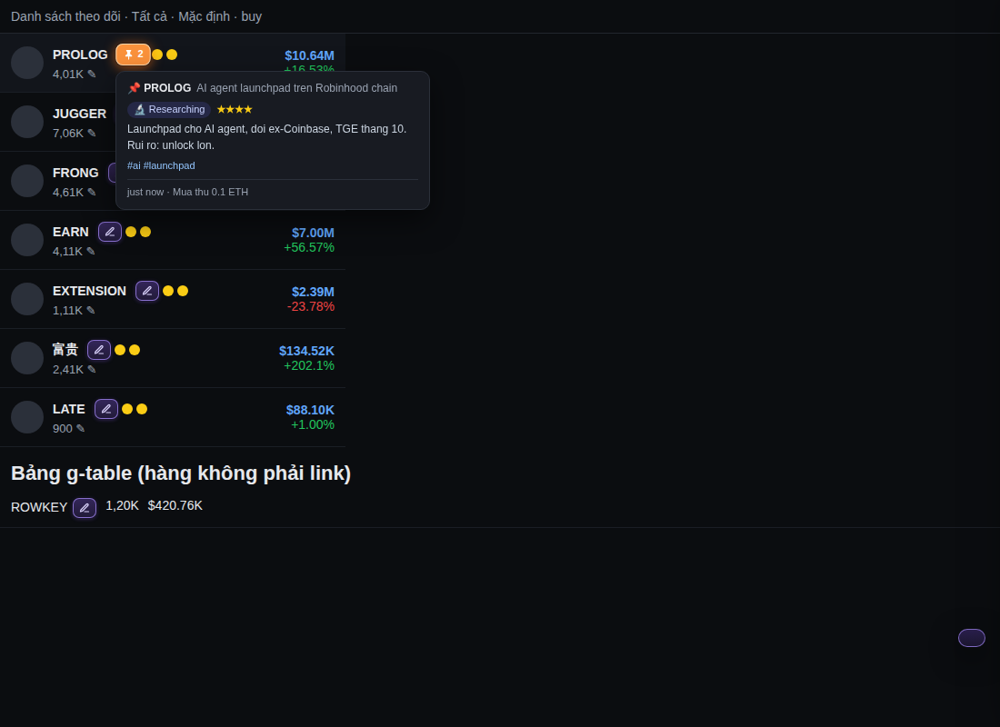
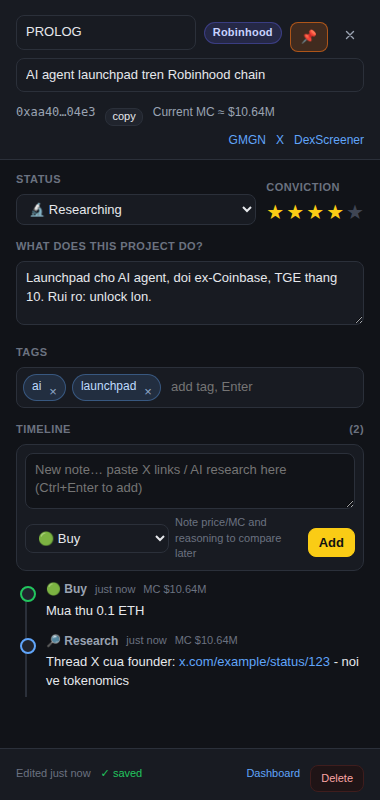

# Noted for GMGN

Chrome extension (Manifest V3) that adds a **✎ Noted** button next to every token on [gmgn.ai](https://gmgn.ai) so you can keep **timeline research notes** per project: what it does, tags, pin, status, conviction, and dated entries (research, news, buy, sell, alerts) with X / AI links.

The goal: when you research hundreds of projects, hovering the button next to a symbol instantly reminds you "what this does, what I found, at what market cap I bought".

UI languages: **English** (default), Tiếng Việt, 中文 — switchable in the popup.





## Features

| Where | What |
|---|---|
| Every token list on gmgn (watchlist, trending, meme, wallets…) | ✎ button right after the symbol. Violet = no note yet, yellow = has a note, orange 📌 = pinned; the number is the timeline length. Hover shows summary, tags and the latest entry. |
| Click the button | Opens Chrome's **Side Panel** on the right (outside the page: the browser shrinks gmgn instead of covering it; drag the edge to resize): symbol, one-line name, status, conviction 1–5, **What does this project do?**, tags, timeline. Autosaves. The market cap shown in the row is stored with each entry ("bought at MC $10.6M"). The popup can switch to an in-page overlay instead. |
| Token page `/{chain}/token/{address}` | Floating button with symbol + summary; click it or press `Alt+N`. |
| Extension icon → Dashboard | All noted projects: full-text search (symbol / name / summary / tag / address / entries), filter by status / tag / pinned, sort, edit in place, add by gmgn URL. |
| Export / import | JSON (backup, manual sync between machines) and Markdown (feed your whole research to an AI). |

Works on every chain gmgn supports (`sol`, `eth`, `base`, `bsc`, `robinhood`, `xlayer`, `blast`, `tron`…): the storage key is `chain:address`, so the same token in the watchlist, trending or detail page points to one note.

## Install (load unpacked)

Requires Chrome / Brave / Edge 116 or newer (Side Panel API).

1. Download the source (clone or Download ZIP and extract).
2. Open `chrome://extensions`, enable **Developer mode**.
3. **Load unpacked** → pick the repo folder (the one containing `manifest.json`).
4. Reload your gmgn.ai tab. The ✎ button appears next to each symbol.

Icons are included in `icons/`; to change them, edit `scripts/make_icons.py` and run `npm run icons` (it also rewrites the `icons` entries in `manifest.json`). The shortcut `Alt+N` can be changed at `chrome://extensions/shortcuts`.

## Suggested research workflow

1. See a new token on gmgn → click ✎ → write 1–3 sentences in **What does this project do?**, add tags (`ai`, `launchpad`, `robinhood`, `narrative-x`…).
2. Research on X / with an AI → paste the thread link or the AI conclusion into **Timeline** as a *Research* entry. Each entry records the time and the market cap at that moment.
3. Decide → change **Status** (Watching → Researching → Holding → Sold / Passed / Dead), set **Conviction**, **📌 pin** the projects you are actively following.
4. Periodically open the Dashboard, filter `📌 pinned only` or by tag, export Markdown and ask an AI "which of the projects I researched deserve a second look?".
5. Export JSON for backup (data lives in the browser's `chrome.storage.local`; uninstalling the extension deletes it).

## Architecture

```
manifest.json            MV3; permissions: storage, unlimitedStorage, activeTab, sidePanel; localized name via _locales/
_locales/                en (default), vi, zh_CN: extension name, description, command label
src/lib/storage.js       NotedStore: data model, chrome.storage.local access, export/import, Markdown
src/lib/i18n.js          NotedI18n: UI strings for en/vi/zh, language setting, helpers for static HTML
src/lib/editor.js        NotedEditor: the note editor UI shared by the Side Panel, the in-page drawer and the dashboard
src/content/gmgn.js      Content script: finds token links, injects buttons, tooltip, floating button; Shadow DOM drawer as fallback
src/content/gmgn.css     Styles for the injected button (light DOM)
src/panel/               Side Panel page (editor for the active tab's token)
src/dashboard/           Dashboard (options page)
src/popup/               Toolbar popup: stats, note-this-token, view mode, language
src/background.js        Service worker: opens the Side Panel, remembers the token per tab (storage.session), keyboard shortcut
scripts/make_icons.py    Dependency-free icon generator
scripts/pack.py          Builds the Web Store ZIP (runtime files only)
test/                    Mock gmgn pages + Playwright e2e test that loads the real extension
```

Key decisions:

- **No build step, no framework.** Vanilla JS loaded straight with Load unpacked; edit a file, press reload. Enough for a personal tool and easy to tweak.
- **Tokens are detected by URL, not by CSS class.** gmgn is a Next.js app with hashed, frequently changing class names, but every token row links to `/{chain}/token/{address}`. The content script scans `a[href*="/token/"]`, inserts the button right after the symbol text node, and uses a `MutationObserver` to catch rows added while scrolling (virtualized lists). A fallback handles gmgn's `g-table` rows whose `data-row-key` is the token address.
- **Key `chain:address`**, EVM addresses lower-cased, referral prefixes (`abc_`) in shared links stripped.
- **One storage key per project** (`p:chain:address`) in `chrome.storage.local` instead of one giant object: fast writes, unlimited projects (`unlimitedStorage`). `storage.sync` is not used because its 100 KB quota cannot hold hundreds of timelines.
- **Editor in Chrome's Side Panel** (Chrome ≥ 116) rather than an overlay: gmgn's viewport is genuinely narrowed, its fixed header and trade panels stay visible, and the panel persists while switching tokens. The content script sends a message, the background calls `sidePanel.open()` inside the user gesture and remembers the token per tab in `storage.session`. If the panel cannot open (or the user chooses "Overlay" in the popup) a Shadow DOM drawer inside the page is used, with CSS isolated from gmgn.
- The injected button stops `click/mousedown` propagation so the row's own navigation is not triggered.
- **Runtime i18n** (`settings.lang`) instead of relying only on `chrome.i18n`, so the UI language can be chosen independently of the browser language. Manifest strings still use `_locales/` as Chrome requires.

### Data model

```js
{
  key: "robinhood:0xaa40…04e3", chain: "robinhood", address: "0xaa40…04e3",
  symbol: "PROLOG", name: "AI agent launchpad on Robinhood chain",
  summary: "What it does, why it matters, risks…",
  tags: ["ai", "launchpad"], pinned: true, status: "researching", rating: 4,
  timeline: [
    { id, ts, type: "research", text: "Founder thread: https://x.com/…", mc: "$10.64M" },
    { id, ts, type: "buy", text: "Bought 0.1 ETH", mc: "$10.64M" }
  ],
  createdAt, updatedAt
}
```

Entry types: `note`, `research`, `news`, `buy`, `sell`, `alert`, `link`. Statuses: `watching`, `researching`, `holding`, `sold`, `passed`, `dead`.

## If the button does not appear on gmgn

gmgn.ai was blocked in the environment where this extension was developed, so button injection was verified against a mock page that mirrors the watchlist structure (rows are `<a href="/{chain}/token/…">`) plus a `g-table` with `data-row-key`. If a list on the real site shows no button:

1. Open DevTools on gmgn, pick the **Noted for GMGN** context in the Console dropdown and run `document.querySelectorAll('a[href*="/token/"]').length`. If it is 0 the rows are not links; inspect what attribute they use (e.g. `data-row-key`) and extend `scan()` in `src/content/gmgn.js`.
2. Token pages always have the floating button and `Alt+N` because they rely on the URL, not the DOM.
3. The Dashboard has **Add from gmgn URL** to note any token from its link.

## Publishing to the Chrome Web Store

1. Package: `python3 scripts/pack.py` (or `npm run zip`) creates `dist/noted-for-gmgn-<version>.zip` containing only `manifest.json`, `icons/`, `src/`, `_locales/` with the manifest at the ZIP root.
2. Go to https://chrome.google.com/webstore/devconsole, register a developer account (one-time 5 USD fee) → **New item** → upload the ZIP.
3. **Store listing**: title, description (copy-paste texts in `docs/store-listing.md`, in English, Vietnamese and Chinese), at least one 1280×800 screenshot (samples in `docs/store/`), category Productivity.
4. **Privacy practices**: single purpose "personal research notes for tokens on gmgn.ai", per-permission justifications (table below), "does not collect user data" (everything stays in `chrome.storage.local`), no remote code. Privacy policy: `PRIVACY.md`.
5. **Distribution** → **Unlisted** for personal use (hidden from search, installable by link, auto-updates) or Public.
6. **Submit for review** (usually 1–3 days). For updates: bump `version` in `manifest.json`, repackage, upload under the Package tab.

| Permission | Justification |
|---|---|
| `storage`, `unlimitedStorage` | Store the user's notes locally, without a project limit |
| `activeTab` | Read the current tab's gmgn URL when the user clicks the icon or presses the shortcut, to open that token's note |
| `sidePanel` | Show the note editor in Chrome's side panel so it does not cover gmgn |
| Content script on `gmgn.ai` | Add the note button next to each token and show the note indicator inline |

## Roadmap ideas

- **Capture from X:** a content script on x.com with a "Save to Noted" button on each tweet.
- **AI summary:** a "Summarize" button that sends the timeline + links to an API (key stored in options) and fills "What does this project do?".
- **Multi-device sync:** a small backend (Supabase/Firebase) or JSON sync via Google Drive, keeping `chrome.storage.local` as cache.
- **Reminders:** flag projects not reviewed for 14 days.
- **Price snapshots:** record MC every time a note is opened and draw a mini chart against your entries.

## Development

```bash
npm test            # Playwright e2e (uses Playwright's Chromium, no real gmgn needed)
npm run icons       # regenerate icons
npm run zip         # build the Web Store ZIP into dist/
node test/store-shots.js   # regenerate 1280×800 store screenshots into docs/store/
```
