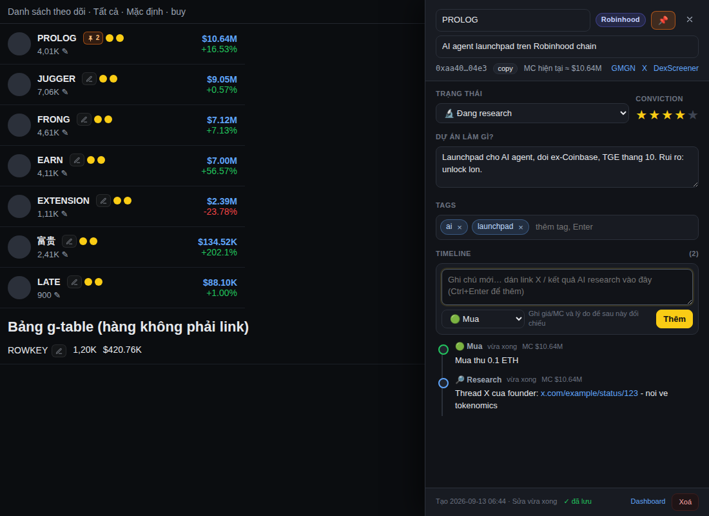
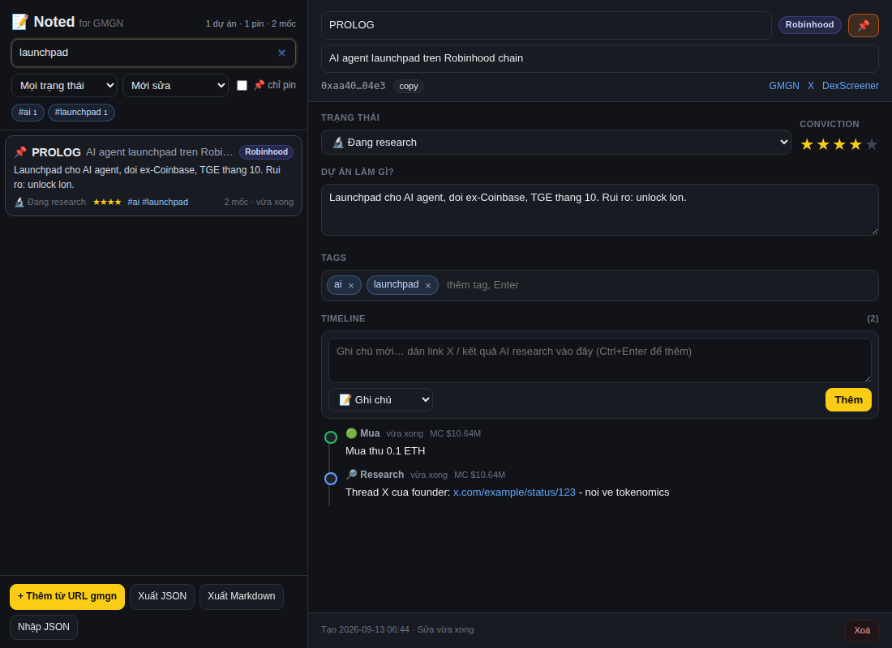

# Noted for GMGN

Extension Chrome (Manifest V3) thêm nút **✎ Noted** cạnh mỗi token trên [gmgn.ai](https://gmgn.ai) để bạn ghi chú research theo **timeline** cho từng dự án: dự án làm gì, tag, pin, trạng thái, mức tin tưởng, các mốc (research, tin tức, mua, bán, cảnh báo) kèm link X / kết quả AI.

Mục tiêu: khi research hàng trăm dự án, chỉ cần rê chuột vào nút cạnh symbol là nhớ lại ngay "dự án này làm gì, mình đã thấy gì, đã mua ở MC nào".



## Tính năng

| Ở đâu | Có gì |
|---|---|
| Mọi danh sách token trên gmgn (theo dõi, trending, meme, ví…) | Nút ✎ ngay sau symbol. Vàng = đã có ghi chú, cam 📌 = đã pin, số = số mốc timeline. Rê chuột hiện tóm tắt + tag + mốc mới nhất. |
| Bấm nút | Drawer bên phải: symbol, tên/mô tả một dòng, trạng thái, conviction 1–5, **Dự án làm gì?**, tags, timeline. Tự lưu. MC trong hàng được lưu kèm mỗi mốc ("Mua ở MC $10.6M"). |
| Trang token `/{chain}/token/{address}` | Nút nổi góc dưới phải hiện symbol + tóm tắt; bấm hoặc `Alt+N` để mở ghi chú. |
| Icon extension → Dashboard | Danh sách mọi dự án đã ghi chú: tìm theo symbol/tên/tóm tắt/tag/địa chỉ/nội dung mốc, lọc trạng thái/tag/pin, sắp xếp; sửa ngay tại chỗ; thêm từ URL gmgn. |
| Xuất / nhập | JSON (backup, đồng bộ tay giữa máy) và Markdown (đưa cho AI tổng hợp lại toàn bộ research). |

Hỗ trợ mọi chain gmgn có (`sol`, `eth`, `base`, `bsc`, `robinhood`, `xlayer`, `blast`, `tron`…): khóa dữ liệu là `chain:address`, nên cùng một token ở watchlist, trending hay trang chi tiết đều trỏ về một ghi chú.



## Cài đặt (load unpacked)

1. Tải mã nguồn (clone repo hoặc Download ZIP rồi giải nén).
2. Chrome/Brave/Edge: mở `chrome://extensions`, bật **Developer mode**.
3. **Load unpacked** → chọn thư mục repo (chứa `manifest.json`).
4. Tải lại tab gmgn.ai. Nút ✎ sẽ xuất hiện cạnh symbol trong danh sách.

Icon đã có sẵn trong `icons/`; muốn đổi thì sửa `scripts/make_icons.py` rồi chạy `npm run icons` (script tự khai báo lại vào `manifest.json`).

Phím tắt `Alt+N` (mở ghi chú token đang xem) có thể đổi ở `chrome://extensions/shortcuts`.

## Cách dùng gợi ý cho quy trình research

1. Thấy token mới trên gmgn → bấm ✎ → gõ 1–3 câu vào **Dự án làm gì?**, gắn tag (`ai`, `launchpad`, `robinhood`, `narrative-x`…).
2. Research trên X / AI → dán link thread, kết luận của AI vào **Timeline** với loại *Research*. Mỗi mốc tự gắn thời gian và MC lúc ghi.
3. Quyết định → đổi **Trạng thái** (Theo dõi → Đang research → Đang giữ → Đã bán / Bỏ qua / Dead), chấm **Conviction**, **📌 pin** những dự án đang bám.
4. Định kỳ mở Dashboard, lọc `📌 chỉ pin` hoặc theo tag, xuất Markdown đưa cho AI hỏi "trong các dự án tôi đã research, cái nào đáng xem lại?".
5. Xuất JSON để backup (dữ liệu nằm trong `chrome.storage.local` của trình duyệt, xóa extension là mất).

## Kiến trúc (đề xuất và lý do)

```
manifest.json            MV3, chỉ cần quyền storage + unlimitedStorage + activeTab
src/lib/storage.js       NotedStore: model dữ liệu, đọc/ghi chrome.storage.local, export/import, Markdown
src/lib/editor.js        NotedEditor: UI ghi chú dùng chung (drawer trên gmgn và panel trong dashboard)
src/content/gmgn.js      Content script: quét link token, gắn nút, tooltip, FAB, drawer (Shadow DOM)
src/content/gmgn.css     Style cho nút gắn trong trang (light DOM)
src/dashboard/           Trang tổng hợp (options page)
src/popup/               Popup icon extension
src/background.js        Service worker: phím tắt, mở dashboard
scripts/make_icons.py    Sinh icon PNG, không cần thư viện ngoài
test/                    Trang gmgn giả lập + test Playwright nạp extension thật
```

Các lựa chọn chính:

- **Không cần build, không framework.** Vanilla JS, nạp thẳng bằng Load unpacked; sửa file là F5 thấy ngay. Đủ cho một tool cá nhân và dễ tự chỉnh.
- **Nhận diện token qua URL, không qua class CSS.** gmgn là app Next.js, class bị băm và đổi thường xuyên; nhưng mọi hàng token đều link tới `/{chain}/token/{address}`. Content script quét `a[href*="/token/"]`, chèn nút ngay sau text node symbol, và dùng `MutationObserver` để bắt hàng mới khi cuộn (danh sách ảo). Dự phòng thêm cho bảng `g-table` có `data-row-key` là địa chỉ token.
- **Khóa `chain:address`**, địa chỉ EVM về chữ thường, bỏ tiền tố mã giới thiệu `abc_` nếu có trong link chia sẻ.
- **Mỗi dự án một key riêng** trong `chrome.storage.local` (`p:chain:address`) thay vì một object khổng lồ: ghi nhanh, không giới hạn số dự án (`unlimitedStorage`). Không dùng `storage.sync` vì giới hạn 100 KB, không đủ cho timeline hàng trăm dự án.
- **UI trong Shadow DOM** để CSS của gmgn và của extension không đè lên nhau; nút chèn trong trang thì chặn `click/mousedown` để không kích hoạt điều hướng của hàng.
- **Editor dùng chung** giữa drawer và dashboard nên sửa một chỗ là cả hai nơi đổi.

### Model dữ liệu

```js
{
  key: "robinhood:0xaa40…04e3", chain: "robinhood", address: "0xaa40…04e3",
  symbol: "PROLOG", name: "AI agent launchpad trên Robinhood chain",
  summary: "Dự án làm gì, vì sao đáng chú ý, rủi ro…",
  tags: ["ai", "launchpad"], pinned: true, status: "researching", rating: 4,
  timeline: [
    { id, ts, type: "research", text: "Thread founder: https://x.com/…", mc: "$10.64M" },
    { id, ts, type: "buy", text: "Mua thử 0.1 ETH", mc: "$10.64M" }
  ],
  createdAt, updatedAt
}
```

Loại mốc: `note`, `research`, `news`, `buy`, `sell`, `alert`, `link`. Trạng thái: `watching`, `researching`, `holding`, `sold`, `passed`, `dead`.

## Nếu nút không xuất hiện trên gmgn

gmgn bị chặn trong môi trường phát triển extension này nên phần gắn nút được kiểm thử trên trang giả lập có cấu trúc giống watchlist (hàng là `<a href="/{chain}/token/…">`) và bảng `g-table` có `data-row-key`. Nếu trên gmgn thật nút không hiện ở một danh sách nào đó:

1. Mở DevTools trên gmgn, chọn context **Noted for GMGN** trong dropdown của Console, gõ `document.querySelectorAll('a[href*="/token/"]').length`. Nếu ra 0 thì hàng đó không phải link; xem hàng dùng thuộc tính gì (ví dụ `data-row-key`) và bổ sung vào hàm `scan()` trong `src/content/gmgn.js`.
2. Trang token luôn có nút nổi và `Alt+N` vì dựa vào URL, không phụ thuộc DOM.
3. Dashboard có **Thêm từ URL gmgn** để ghi chú bất kỳ token nào chỉ bằng link.

## Roadmap gợi ý

- **Bắt link từ X:** content script trên x.com thêm nút "Lưu vào Noted" ở mỗi tweet, chọn dự án rồi đẩy vào timeline.
- **Tóm tắt bằng AI:** nút "Tóm tắt" trong drawer gửi các mốc + link tới API (Claude/OpenAI, key lưu ở options) và điền vào "Dự án làm gì?".
- **Đồng bộ nhiều máy:** thêm backend nhỏ (Supabase/Firebase) hoặc đồng bộ file JSON qua Google Drive; giữ `chrome.storage.local` làm cache.
- **Nhắc lại:** tự động thêm mốc "chưa xem lại 14 ngày" hoặc badge màu khác cho dự án lâu không cập nhật.
- **Snapshot giá:** lưu MC mỗi lần mở ghi chú để vẽ mini-chart MC theo các mốc bạn đã ghi.

## Phát triển

```bash
npm test            # chạy test Playwright (dùng Chromium của Playwright, không cần gmgn thật)
npm run icons       # sinh lại icon
npm run zip         # đóng gói để cài ở máy khác
```
