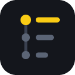

# Research-Noted-Gmgn

**[Install from the Chrome Web Store](https://chromewebstore.google.com/detail/klmbonadppdmggifjlolbbpaaafkmplm)** · version 0.9.14

A Chrome extension that keeps one research note per token, right where you look at it: **gmgn.ai**, **DexScreener** and **X**.

You research hundreds of tokens and forget what each one actually does. This keeps a short summary and a dated timeline for every project, one click away from the chart.

📖 **[User guide](docs/guide.md)** — written for people who are not technical. Also in [Tiếng Việt](docs/huong-dan.md).

**New to gmgn.ai?** It is a multi-chain token trading terminal, and the site this extension was built around. You can open it with [this link](https://gmgn.ai/r/ZCSRo81H?chain=robinhood) — it is the author's referral link, and the same link is shown (labelled *referral link*) in the extension's empty panel, empty Dashboard and toolbar popup. The extension never opens it by itself and adds no code to any page or URL.

---

## How it works

### 1. One button for the token you are looking at

Open a token on gmgn (or a pair on DexScreener). A single button appears at the bottom right: `📝 Note MEME · Robinhood`. Click it and the note opens in Chrome's side panel — beside the page, never on top of it. Click again to close.

Write what the project does, add tags, set a status and a conviction score, and add timeline entries as you learn things. Everything saves as you type.


Open the side panel on a tab that has no token — the X home page, a new tab — and it shows the token you viewed last instead of an empty screen, so the note you were working on is always one click away.

The same note follows the token everywhere: gmgn, DexScreener, X. Once a note exists the button turns yellow and shows the summary, so you recognise a project you already looked at before clicking.

### 2. Research on X without copy-pasting

Click the **X** link in a note (or gmgn's own X button). It searches X for the contract address, and the extension recognises which token you are researching — the note button appears on the search page too.

Select any text in a post and a **Save selection** button pops up right under it.


Click it and the quote lands in the timeline as `@author: text` with a link back to the post. The side panel opens on that note and flashes the new entry, so you see exactly what was saved. Handles are shown in red so you always know who said it.


### 3. Find it again

The Dashboard lists every project you have noted. Search across summaries, tags, addresses and timeline text; filter by status, tag or pinned; sort by conviction or recency. Export to JSON for backup, or to Markdown to hand your whole research to an AI.


---

## Research with Grok

Click **✨ Research with Grok** in a note. The extension builds a prompt from your template — symbol, chain, contract, current market cap, gmgn link — and opens Grok on X with it prefilled. Press Enter.

When Grok finishes answering, the answer is **saved into the timeline automatically**, with an Undo link. Follow-up answers become new entries; identical text is never saved twice.


No API key: it runs in your own X account. Auto-save can be turned off on the Grok panel or in Settings.

The default prompt ships in English, Vietnamese and Chinese and follows the interface language. It fixes the order of the answer — **DEV** first (confirmed dev or lead with their X link, the token's account, GitHub/LinkedIn, anon or doxxed, previous projects, plus how to tell a real builder from an early follower), then **KOL**, then **PROJECT** written out in six sections (problem, solution, how it runs, design, current state, sourced design risks), then **MEME** only when it is one. It tells the model to write "not found" instead of guessing, not to repeat the address, chain or chart, and to keep X handles as plain `https://x.com/...` URLs so they stay clickable in the timeline. Edit it in Settings; placeholders available: `{symbol} {chain} {address} {name} {mc} {summary} {tags} {status} {notes} {gmgn_url} {dex_url} {x_url} {date}`. `{notes}` injects your five latest timeline entries, so Grok builds on what you already wrote instead of repeating it.

## Settings

Dashboard → **⚙ Settings**: interface language (English, Tiếng Việt, 中文), side panel or in-page overlay, whether the panel follows the token you open, text size (A− / A+, 11–22 px, default 14, applied to the note editor everywhere at once), the Grok prompt template and target, auto-save, and whether token lists also get a small ✎ button on every row (off by default).


---

## Install

Requires Chrome / Brave / Edge 116 or newer.

**From the Chrome Web Store (recommended):** open the [Store page](https://chromewebstore.google.com/detail/klmbonadppdmggifjlolbbpaaafkmplm), click **Add to Chrome**, then reload your gmgn.ai tab. Updates arrive on their own.

**From source (for development, or to run a build before it reaches the Store):**

1. Download the source (clone, or Download ZIP and extract).
2. Open `chrome://extensions` and turn on **Developer mode**.
3. Click **Load unpacked** and pick the folder that contains `manifest.json`.
4. Reload your gmgn.ai tab.

`Alt+N` opens or closes the note for the token in the current tab; change it at `chrome://extensions/shortcuts`.

### Updating without losing data

Notes live in `chrome.storage.local`, which is tied to the extension's ID. For an unpacked extension the ID comes from the folder path, so **update in place**: replace the files inside the same folder (`git pull`, or extract the new ZIP over it), then click **Reload** on `chrome://extensions`. Loading a *new* folder creates a new ID with an empty store (the old data is still under the old entry: export it there, import it here). Export a JSON backup from the Dashboard before updating anyway.

To make the unpacked ID identical to the Web Store ID, copy the public key from the Developer Dashboard (Package → View public key) into a `"key"` field of `manifest.json`; `scripts/pack.py` strips that field from the Store ZIP.

### Where your data lives

On your machine, in the browser, and nowhere else. No server, no account, no analytics. Two things leave the device, both only when you ask: the research prompt when you click Research with Grok, and pair addresses sent to DexScreener's public API to work out which token a pair is. See [PRIVACY.md](PRIVACY.md).

---

## Architecture

```
manifest.json            MV3; permissions: storage, unlimitedStorage, activeTab, sidePanel; localized name via _locales/
_locales/                en (default), vi, zh_CN: extension name, description, command label
src/lib/storage.js       NotedStore: data model, chrome.storage.local access, export/import, Markdown
src/lib/i18n.js          NotedI18n: UI strings for en/vi/zh, language setting, helpers for static HTML
src/lib/editor.js        NotedEditor: the note editor UI shared by the side panel, the in-page drawer and the dashboard
src/lib/research.js      NotedResearch: prompt template, placeholders, deep links to Grok on X and grok.com
src/content/core.js      Shared content-script core: floating button, tooltip, selection saving, opens the side panel; Shadow DOM drawer as fallback
src/content/sites/gmgn.js        Site adapter: tokens from /{chain}/token/{address} links (+ g-table data-row-key fallback)
src/content/sites/dexscreener.js Site adapter: pair links /{chain}/{pair}, resolved to tokens via the background (DexScreener API, cached)
src/content/sites/xsearch.js     Site adapter: X search pages, token from the query (contract / $SYMBOL), save selected text with @author
src/content/badge.css    Styles for the optional per-row button (light DOM)
src/content/grok.js      Content script on x.com/i/grok and grok.com: auto-save panel for Grok answers
src/panel/               Side panel page (editor for the active tab's token)
src/dashboard/           Dashboard (options page) and Settings
src/popup/               Toolbar popup: stats, note-this-token, view mode, language
src/viewer/              Image viewer page (the extension no longer takes screenshots; this only shows images carried in older notes and exports)
src/background.js        Service worker: opens/closes the side panel, remembers the token per tab (storage.session), follow-the-page, shortcut, Grok tabs, DexScreener pair→token resolver
scripts/make_icons.py    Dependency-free icon generator (the timeline mark, 16/32/48/128 px)
scripts/store-assets.js  Store icon (128 px with margin) and small promo tile, rendered from the same mark
scripts/audit.py         Capability audit: permissions, sites, outbound requests, dangerous APIs
scripts/pack.py          Builds the Web Store ZIP (runtime files only)
test/                    Mock gmgn / DexScreener / X / Grok pages + Playwright e2e against the real extension;
                         live.js runs the same checks on the real sites, pw.js locates playwright
```

Key decisions:

- **No build step, no framework.** Vanilla JS loaded with Load unpacked; edit a file, press reload.
- **One core, one adapter per site.** `core.js` owns everything site-independent; an adapter only says how to find the page's token and, optionally, how to attribute a text selection. Adding a site is one small file plus a manifest entry.
- **Tokens are detected by URL, not by CSS class.** gmgn is a Next.js app with hashed, frequently changing class names, but every token page is `/{chain}/token/{address}`. Storage key is `chain:address`, EVM addresses lower-cased, referral prefixes (`abc_`) stripped — so one note serves every surface.
- **DexScreener links are pairs, not tokens**, so they are resolved through the public DexScreener API (`/latest/dex/pairs/{chain}/{addresses}` batched by 30, falling back to `/latest/dex/tokens/` and then `/latest/dex/search`), cached forever in `chrome.storage.local`. Inverted pairs (base = WSOL/USDC…) pick the other side.
- **One storage key per project** (`p:chain:address`) instead of one giant object: fast writes, unlimited projects (`unlimitedStorage`). `storage.sync` is not used because its 100 KB quota cannot hold hundreds of timelines.
- **Editor in Chrome's side panel** (Chrome ≥ 116) rather than an overlay: the page's viewport is genuinely narrowed instead of covered. The content script sends a message and the background calls `sidePanel.open()` inside the user gesture, remembering the token per tab in `storage.session`; a second click disables the panel for that tab. A Shadow DOM drawer inside the page is the fallback, and an explicit option.
- **Research via deep link, not an embedded Grok.** x.com forbids framing and its login cookies would not work inside an extension page, so Grok is opened in a tab with the prompt in the URL. The answer-capture heuristic is DOM-agnostic: the last minimal text block after the prompt bubble, saved once it has stopped changing for 3 s.
- **Runtime i18n** (`settings.lang`) instead of relying only on `chrome.i18n`, so the UI language is independent of the browser language.

### Data model

```js
{
  key: "robinhood:0xaa40…04e3", chain: "robinhood", address: "0xaa40…04e3",
  symbol: "PROLOG", name: "AI agent launchpad on Robinhood chain",
  summary: "What it does, why it matters, risks…",
  tags: ["ai", "launchpad"], pinned: true, status: "holding", rating: 4,
  timeline: [
    { id, ts, type: "research", text: "@theunipcs: tokenomics look clean…", mc: "$2.10M" },
    { id, ts, type: "buy", text: "Bought 0.2 ETH", mc: "$4.80M" }
  ],
  createdAt, updatedAt
}
```

Entry types: `note`, `research`, `news`, `buy`, `sell`, `alert`, `link`. Statuses: `watching`, `researching`, `holding`, `sold`, `passed`, `dead`.

## If the button does not appear

Every feature is covered by an e2e suite against mock pages that mirror the three sites, and `npm run test:live` drives the real extension on the real gmgn.ai, DexScreener and X (last run: floating button, side panel open/close, follow-the-token and DexScreener pair→token all pass on the live sites). Sites change their markup, though. If a real page shows no button:

1. Open DevTools → Console on that page and filter for `Research-Noted-Gmgn`. The content script logs what it detected.
2. Token pages, pair pages and X searches rely on the URL, not the DOM, so they should always work; the per-row buttons (optional) are the fragile part.
3. The Dashboard has **Add from gmgn URL** to note any token from its link.

## Publishing to the Chrome Web Store

1. Package: `python3 scripts/pack.py` (or `npm run zip`) creates `dist/research-noted-gmgn-<version>.zip` containing only `manifest.json`, `icons/`, `src/`, `_locales/`, with the manifest at the ZIP root.
2. Go to https://chrome.google.com/webstore/devconsole. First time: register a developer account (one-time 5 USD fee) → **New item** → upload the ZIP. For an update: open the existing item → **Package** → **Upload new package**.
3. **Store listing**: title, description (copy-paste texts in `docs/store-listing.md`, in English, Vietnamese and Chinese), at least one 1280×800 screenshot (ready-made in `docs/store/`), category Productivity.
4. **Privacy practices**: single purpose, per-permission justifications (table below), no remote code. Privacy policy: `PRIVACY.md`.
5. **Distribution** → **Unlisted** for personal use (hidden from search, installable by link, auto-updates) or Public.
6. **Submit for review** (usually 1–3 days). For updates: bump `version` in `manifest.json` and `package.json` (the Store rejects a ZIP whose version is not higher than the published one), repackage, upload under the Package tab.

An update that adds sites or permissions (for example the step from 0.3.0, gmgn only, to a build with DexScreener, X and Grok) gets a longer review, needs the new rows of the justification table filled in under **Privacy practices**, and Chrome disables the extension for existing users until they accept the new permissions. Their notes are kept. The Store title follows the `name` in `_locales/*/messages.json`, so it changes with the package.

| Permission | Justification |
|---|---|
| `storage`, `unlimitedStorage` | Store the user's notes locally, without a project limit |
| `activeTab` | Read the current tab's URL when the user clicks the icon or presses the shortcut, to open that token's note |
| `sidePanel` | Show the note editor in Chrome's side panel so it does not cover the page |
| Content script on `gmgn.ai` | Show the note button for the token being viewed |
| Content script on `dexscreener.com` | Show the note button for the pair being viewed |
| Host permission `api.dexscreener.com` | Resolve a DexScreener pair address to its token (symbol, address, market cap) so notes share one key with gmgn |
| Content script on `x.com/i/grok`, `grok.com` | Save Grok's research answer into the token's note |
| Content script on `x.com/search`, `twitter.com/search` | Recognise the token being researched from the search query and save selected text into its note |

## Is it safe to install?

A fair question for a crypto tool. The short answer is that this extension can only run on five domains, cannot reach your wallet, and sends nothing but public pair addresses.

```bash
python3 scripts/audit.py     # prints exactly what the extension may do, and fails on anything unexpected
```

The audit reads the source and reports the declared permissions, the sites the content scripts run on, every outbound request, and whether any dangerous API is used (eval, cookies, clipboard, history, native messaging, wallet objects in the page). It exits non-zero if anything falls outside the allowlist, so it is worth running on any fork before installing it.

Why your keys are out of reach: Chrome isolates extensions from each other, so this one cannot read MetaMask's or Phantom's storage; private keys never appear in gmgn, DexScreener or X pages anyway; and the manifest grants no access to any other site, so there is nowhere else for it to look. It never asks to connect a wallet.

Users can check for themselves in two minutes — `chrome://extensions` → Details → Site access lists the five domains, and DevTools → Network shows no traffic beyond `api.dexscreener.com`. `scripts/pack.py` prints the SHA-256 of the Store ZIP so a published build can be matched against this source.

👉 For people who are not technical: [Is this extension safe?](docs/safety.md) (also in [Tiếng Việt](docs/an-toan.md))

## Security (technical)

Threat model, mitigations and what leaves the device: [SECURITY.md](SECURITY.md). Short version: every value from a page or API is escaped before rendering, messages are validated and tab-scoped, imported JSON is sanitized, extension pages have a strict CSP, and notes never leave `chrome.storage.local`.

## Languages

English is the language of the documentation, the Store listing and the code review surface (commit messages, README, `PRIVACY.md`, `SECURITY.md`). The interface ships in English, Vietnamese and Chinese; the Vietnamese guides in `docs/` and the Vietnamese/Chinese Store texts are optional extras and may lag behind the English ones.

## Roadmap ideas

- **AI in the panel:** call the xAI / Claude / OpenAI API with the user's own key so the answer appears inside the side panel without opening a tab.
- **Multi-device sync:** a small backend (Supabase/Firebase) or JSON sync via Google Drive, keeping `chrome.storage.local` as cache.
- **Reminders:** flag projects not reviewed for 14 days.
- **Price snapshots:** record market cap every time a note is opened and chart it against your entries.

## Development

```bash
npm i && npx playwright install chromium   # once: the test runner and its browser
npm test              # Playwright e2e against the real extension (mock sites, no network needed)
npm run test:panel    # same suite with a real Chrome window (xvfb), so the real Side Panel is exercised
npm run test:live     # runs against the real gmgn / X / DexScreener (needs network + a one-time X login in the test window)
node test/live.js --mock  # same script against the mock pages, to check the script itself before a real run
node test/live.js --skip-x --token <gmgn url> --token2 <another gmgn url> --keep   # your own tokens, no X, leave the window open
node test/live.js --grok  # also runs Research with Grok end to end on the real X. X SENDS the prompt as soon as the link opens, so each run costs one Grok query
npm run audit         # capability audit: permissions, outbound requests, dangerous APIs
npm run icons         # regenerate icons
npm run zip           # build the Web Store ZIP into dist/
node test/shots.js    # regenerate the README and Store screenshots
```

`test:live` opens Playwright's Chromium (Chrome for Testing) with its own profile in `~/.noted-live-profile`, never your everyday Chrome profile. It deliberately does not use branded Google Chrome: Chrome 137 and later silently ignore `--load-extension`, so the window opens but the extension is never loaded. Pass `--channel chrome` to try it anyway; the runner falls back on its own. Without `--dex` it asks the DexScreener API for the most liquid pair of the token under test.

Two console snippets for debugging against the real sites (they only read the page and
send nothing anywhere): paste `scripts/grok-debug.js` into the console of a Grok tab for a
report on why auto-save did or did not fire, and `scripts/grok-snapshot.js` to capture the
page's DOM shape (scripts, images and all attributes but class/dir/role stripped) as a test
fixture.
