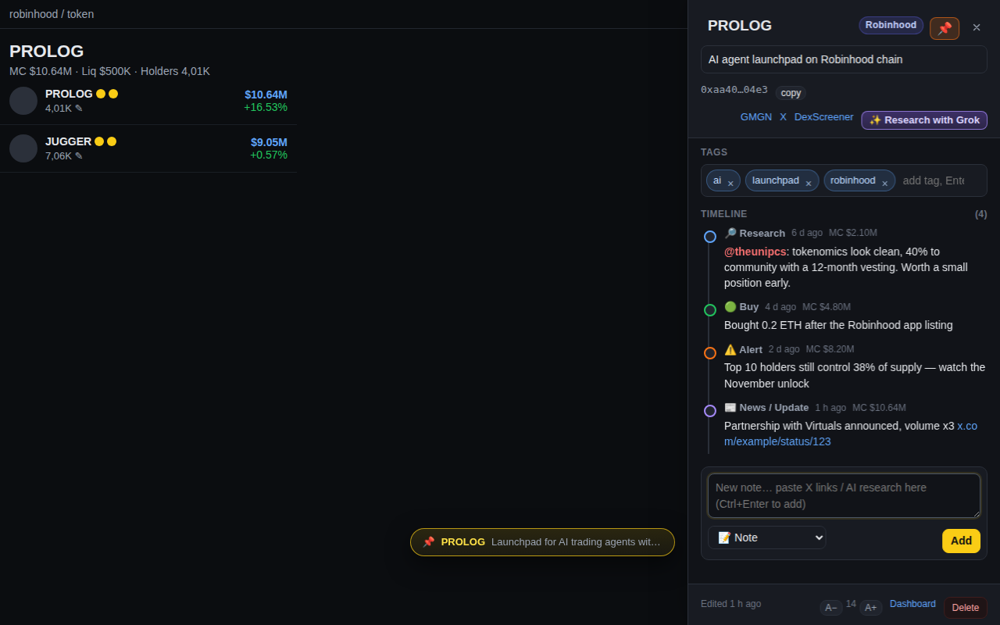
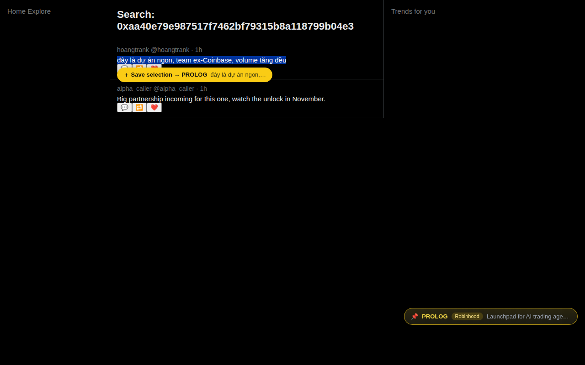
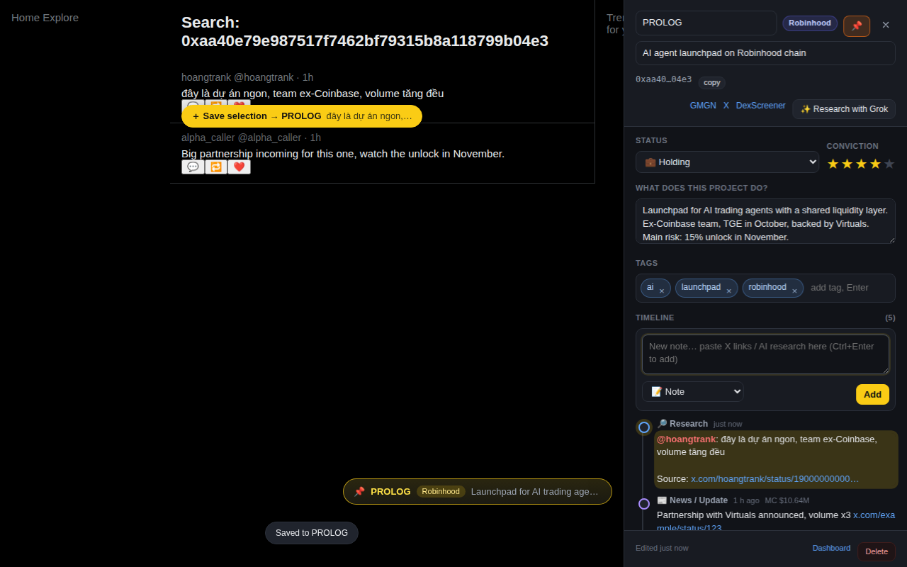
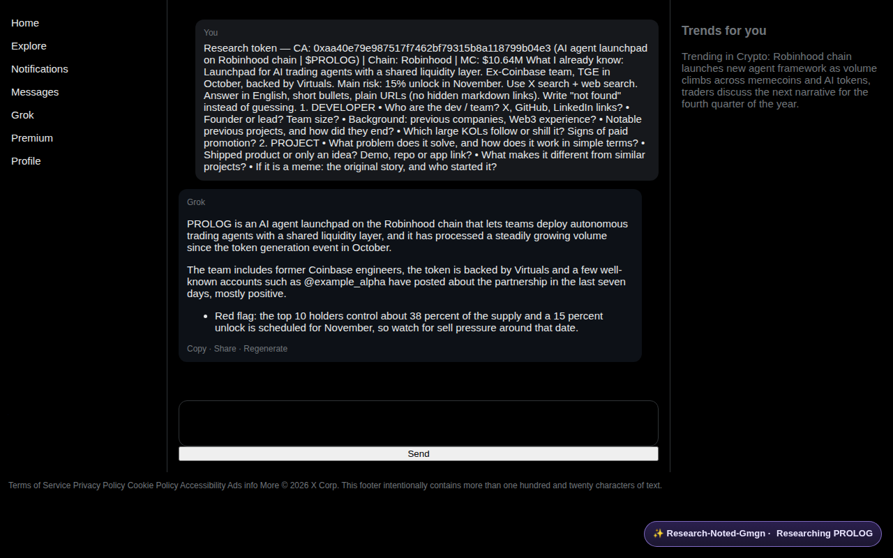
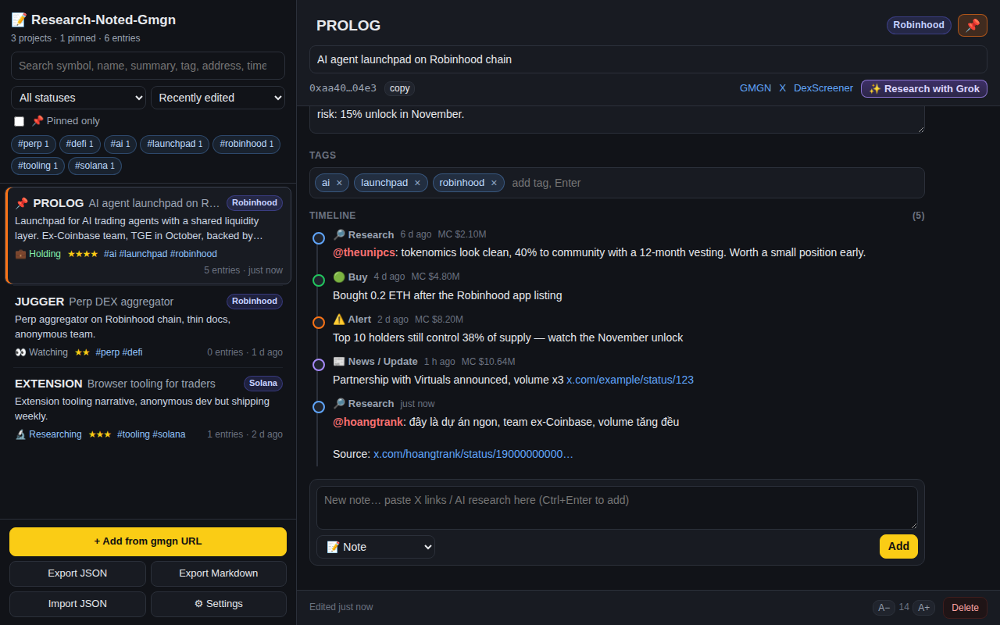
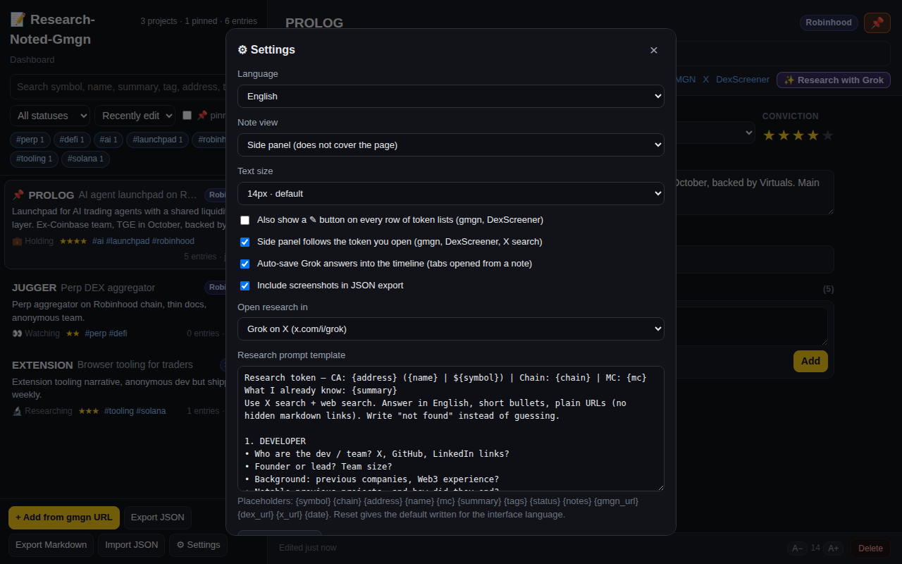

# Hướng dẫn sử dụng Research-Noted-Gmgn

Dành cho người dùng bình thường, không cần biết lập trình.

---

## Nó giúp gì cho bạn?

Bạn xem hàng trăm token trên gmgn mỗi tuần. Vài ngày sau nhìn lại, không nhớ dự án nào làm gì, đã research tới đâu, mua ở mức nào.

Extension này cho bạn một **cuốn sổ tay gắn thẳng vào gmgn**. Mỗi token có một trang ghi chú riêng, mở ra bằng một cú bấm ngay cạnh biểu đồ.

---

## Phần 1 — Cài đặt (làm một lần, khoảng 2 phút)

Bạn cần trình duyệt Chrome, Brave hoặc Edge, bản 116 trở lên. Hầu hết máy đều đã đủ.

1. **Tải mã nguồn về máy.** Vào trang GitHub của dự án, bấm nút xanh **Code** → **Download ZIP**. Giải nén ra một thư mục, ví dụ `D:\noted` hoặc trong thư mục Tài liệu. Nhớ chỗ để, vì sau này cập nhật sẽ dùng lại đúng thư mục này.

2. **Mở trang quản lý extension.** Gõ vào thanh địa chỉ: `chrome://extensions` rồi Enter.

3. **Bật Chế độ dành cho nhà phát triển.** Công tắc nằm ở góc trên bên phải, tên tiếng Anh là *Developer mode*. Bật lên sẽ hiện thêm mấy nút mới.

4. **Bấm "Tải tiện ích đã giải nén"** (*Load unpacked*), rồi chọn thư mục bạn vừa giải nén. Chọn đúng thư mục có file tên `manifest.json` bên trong.

5. Xong. Mở lại tab gmgn.ai đang mở (hoặc bấm F5) là dùng được.

> Nên ghim extension lên thanh công cụ: bấm icon hình mảnh ghép cạnh thanh địa chỉ, rồi bấm hình đinh ghim cạnh tên Research-Noted-Gmgn.

---

## Phần 2 — Ghi chú một dự án

Mở một token bất kỳ trên gmgn. Nhìn xuống **góc dưới bên phải**, bạn sẽ thấy một nút nhỏ:

> 📝 **Note MEME** · Robinhood

Bấm vào đó. Bảng ghi chú mở ra bên phải màn hình. Nó **không che** gmgn, mà đẩy gmgn hẹp lại, nên bạn vừa xem biểu đồ vừa ghi được.

Trong bảng ghi chú, điền từ trên xuống:

| Ô | Ghi gì vào |
|---|---|
| **Tên viết tắt** (ô trên cùng) | Thường tự điền sẵn, ví dụ `MEME` |
| **Dòng mô tả** | Một câu, ví dụ "Launchpad cho AI agent trên Robinhood chain" |
| **Trạng thái** | Đang theo dõi / Đang research / Đang giữ / Đã bán / Bỏ qua / Dead |
| **Conviction** | Bấm số sao, 1 tới 5, thể hiện mức tin tưởng của bạn |
| **Dự án làm gì?** | 2–3 câu quan trọng nhất: sản phẩm, đội ngũ, vì sao đáng chú ý, rủi ro |
| **Tags** | Gõ rồi Enter, ví dụ `ai`, `launchpad`, `robinhood` |
| **Timeline** | Từng mốc theo thời gian, xem phần dưới |

Mọi thứ **tự lưu** khi bạn gõ. Không có nút Save, không sợ quên.

Bảng ghi chú **đi theo token bạn đang xem**: bấm sang token khác trên gmgn thì bảng tự nhảy sang ghi chú của token đó, không cần đóng mở lại. Bấm nút nổi **📝 Note {SYMBOL}** lần nữa là đóng bảng.

**Timeline** là phần giá trị nhất. Mỗi khi biết thêm điều gì, gõ vào ô "Ghi chú mới", chọn loại (Ghi chú, Research, Tin tức, Mua, Bán, Cảnh báo) rồi bấm Thêm. Mỗi mốc tự ghi lại thời gian và **vốn hoá lúc đó**, nên sau này bạn biết mình mua ở mức nào, tin đó ra lúc dự án còn bao nhiêu.

Bấm **📌** ở góc trên để ghim những dự án bạn đang bám sát.

Bấm lại nút ở góc dưới phải một lần nữa để đóng bảng ghi chú.

> **Mẹo:** dự án đã có ghi chú thì nút chuyển sang **màu vàng** và hiện luôn câu tóm tắt. Nhìn là biết mình từng xem qua rồi, khỏi research lại từ đầu.

Extension chạy y hệt trên **DexScreener**. Cùng một token thì dùng chung một ghi chú, dù bạn mở ở gmgn hay DexScreener.

---

## Phần 3 — Research trên X và lưu lại điều đáng nhớ

Trong bảng ghi chú có dòng link: **GMGN · X · DexScreener**. Bấm **X** là mở trang tìm kiếm X theo địa chỉ contract của token. (Nút X sẵn có trên gmgn cũng ra kết quả tương tự.)

Ở trang tìm kiếm đó, extension tự hiểu bạn đang research token nào, nên nút ghi chú vẫn hiện ở góc dưới phải.

Bây giờ **bôi đen** đoạn nào bạn thấy đáng lưu trong một bài đăng. Một nút vàng hiện ra ngay dưới đoạn vừa bôi:

Bấm nút đó. Nút đổi sang **màu xanh kèm dấu ✓** ngay tại chỗ để bạn biết đã lưu. Đoạn chữ vào thẳng timeline của dự án, kèm **tên người nói** và link về bài gốc. Bảng ghi chú mở ra và **nháy vàng** ngay mốc vừa lưu để bạn thấy nó nằm đâu.

Bỏ bôi đen hoặc bấm ra chỗ khác thì nút tự biến mất.

Tên tài khoản như `@theunipcs` hiện **màu đỏ**, nên lướt timeline là biết ngay ai nói câu nào.

---

## Phần 4 — Nhờ Grok research giúp

Trong bảng ghi chú, bấm **✨ Research with Grok**.

Extension tự soạn sẵn câu hỏi gồm tên token, chain, địa chỉ contract, vốn hoá hiện tại và link gmgn, rồi mở Grok trên X với câu hỏi đã điền sẵn. Bạn chỉ cần **nhấn Enter**.

Grok trả lời xong, câu trả lời **tự động lưu vào timeline**. Bạn không phải copy paste gì cả. Có nút **Undo** nếu không muốn giữ.

Hỏi tiếp trong cùng cuộc trò chuyện thì mỗi câu trả lời thành một mốc mới. Nội dung giống hệt không bao giờ bị lưu hai lần.

Câu hỏi mặc định đã viết sẵn bằng tiếng Việt (theo ngôn ngữ giao diện bạn chọn) và yêu cầu Grok trả lời theo 2 mục: **DEVELOPER** (dev là ai, background, dự án trước, KOL nào đang đẩy) và **PROJECT** (giải quyết vấn đề gì, đã có sản phẩm chưa, khác gì đối thủ, nếu là meme thì câu chuyện gốc). Nó cũng dặn Grok ghi "không tìm thấy" thay vì đoán bừa, và để link dạng đầy đủ cho bạn bấm được từ trong ghi chú.

Muốn sửa câu hỏi: Dashboard → ⚙ Settings → ô **Mẫu prompt research**. Các biến dùng được: `{symbol} {chain} {address} {name} {mc} {summary} {tags} {status} {notes} {gmgn_url} {dex_url} {x_url} {date}`. Riêng `{notes}` sẽ chèn 5 mốc gần nhất bạn đã ghi, để Grok bổ sung thêm chứ không nói lại thứ bạn đã biết.

Lưu ý nhỏ: bạn **phải nhấn Enter một lần** để gửi câu hỏi, và **đừng đóng tab Grok** trước khi thấy dòng "Auto-saved". Sau đó bạn cứ đi làm việc khác, nó tự lưu.

Dưới ô "Tự lưu câu trả lời" luôn có một dòng chữ nhỏ cho biết nó đang làm gì: *đang chờ bạn gửi prompt*, *đang đọc câu trả lời*, hay *tự lưu đang tắt*. Nếu vì lý do nào đó nó không bắt được câu trả lời, bấm **Bắt câu trả lời** rồi **Lưu** là xong.

---

## Phần 5 — Xem lại tất cả

Bấm icon extension trên thanh công cụ → **Mở Dashboard**.

Ở đây bạn có:

- **Ô tìm kiếm**: gõ gì cũng tìm được, kể cả chữ nằm sâu trong timeline.
- **Bộ lọc**: theo trạng thái, theo tag, hoặc chỉ những dự án đã ghim.
- **Sắp xếp**: mới sửa, conviction cao nhất, nhiều mốc nhất.
- **Xuất JSON**: file sao lưu. Nên làm định kỳ.
- **Xuất Markdown**: file chữ dễ đọc, đưa cho AI hỏi "trong những dự án tôi đã research, cái nào đáng xem lại?".
- **Thêm từ URL gmgn**: dán link token là ghi chú được, không cần mở trang.

---

## Phần 6 — Cài đặt riêng

Dashboard → **⚙ Settings**:

- **Ngôn ngữ**: English, Tiếng Việt, 中文.
- **Kiểu hiển thị ghi chú**: bảng bên phải (khuyên dùng) hoặc lớp phủ trong trang.
- **Bảng tự đổi theo token đang mở**: bật thì bấm token nào, bảng chuyển sang token đó.
- **Mẫu câu hỏi cho Grok**: sửa được tuỳ ý.
- **Tự lưu câu trả lời Grok**: bật/tắt.
- **Hiện thêm nút ✎ ở từng dòng danh sách**: mặc định tắt cho gọn. Bật nếu bạn muốn ghi chú nhanh ngay từ danh sách.

---

## Câu hỏi thường gặp

**Cài extension lạ vào máy có nguy hiểm không? Nó có lấy được ví của tôi không?**
Không lấy được, và bạn tự kiểm tra được trong 2 phút. Đọc bài riêng: [Extension này có an toàn không?](an-toan.md)

**Dữ liệu của tôi nằm ở đâu? Có ai xem được không?**
Nằm ngay trong trình duyệt trên máy bạn. Không có máy chủ, không tài khoản, không ai xem được. Chỉ hai thứ rời khỏi máy, và chỉ khi bạn chủ động bấm: câu hỏi gửi cho Grok, và địa chỉ cặp giao dịch gửi cho DexScreener để biết đó là token nào. Ghi chú thì không bao giờ.

**Lưu có ngay không?**
Có. Ngay khi bạn gõ hoặc bấm lưu, dữ liệu đã nằm trong máy.

**Ghi chú nhiều có làm chậm máy không?**
Không. Vài nghìn dự án vẫn nhẹ. Mỗi dự án chỉ vài KB chữ.

**Có tốn tiền không?**
Không. Grok chạy bằng tài khoản X của bạn, không cần mua API.

**Tôi đổi máy thì sao?**
Máy cũ: Dashboard → Xuất JSON. Máy mới: cài extension → Dashboard → Nhập JSON. Nhập là gộp thêm, không xoá cái đang có.

**Gỡ extension có mất dữ liệu không?**
Có. Nên xuất JSON để dành trước khi gỡ.

**Cập nhật bản mới thế nào mà không mất ghi chú?**
Quan trọng: **thay file vào đúng thư mục cũ**, đừng chọn thư mục mới. Xoá các file cũ trong thư mục đó, giải nén bản mới vào đúng đó, rồi vào `chrome://extensions` bấm nút **Tải lại** (hình mũi tên tròn). Dữ liệu giữ nguyên.
Nếu lỡ chọn thư mục mới, dữ liệu vẫn chưa mất: bật lại mục cũ trong `chrome://extensions`, xuất JSON, rồi nhập vào mục mới.

**Không thấy nút đâu cả?**
Ba việc theo thứ tự: kiểm tra trong `chrome://extensions` xem extension có đang bật không; đóng tab gmgn rồi mở lại (extension chỉ chạy vào tab mở sau khi cài); kiểm tra số phiên bản có đúng bản mới không.

---

## Quy trình gợi ý hằng ngày

1. Thấy token lạ trên gmgn → bấm nút ghi chú → gõ 2 câu "dự án này làm gì" → gắn 1–2 tag.
2. Bấm **X** để xem người ta nói gì → bôi đen câu đáng giá → lưu.
3. Bấm **Research with Grok** → Enter → để đó, câu trả lời tự vào timeline.
4. Quyết định xong thì đổi **Trạng thái**, chấm **Conviction**, ghim 📌 nếu đang bám.
5. Cuối tuần mở Dashboard, lọc những dự án đã ghim, đọc lại timeline rồi quyết định giữ hay bỏ.

Chỉ cần làm bước 1 đều đặn, ba tháng sau bạn sẽ có một cuốn sổ mà không AI nào thay thế được: nó ghi đúng những gì **bạn** đã thấy và đã nghĩ.
